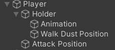
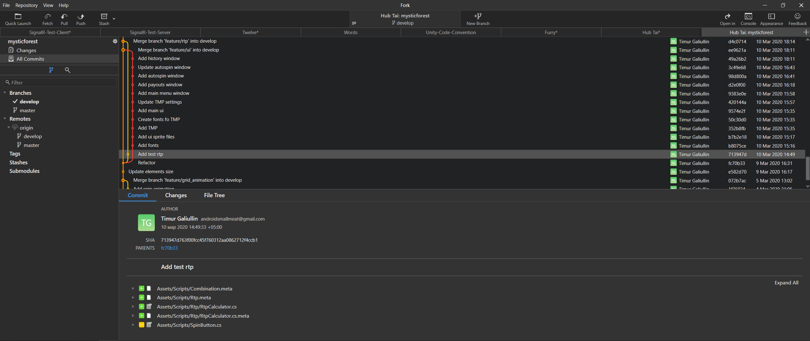

# Unity Project Standards
Стандарты разработки Unity проектов
## Оглавление
- [Код](#код)
- [Unity проект](#unity-проект)
- [Контроль версий](#контроль-версий)
## Код
### C#
- Для классов, имен файлов, namespace'ов, методов, свойств используется **PascalCase**
- Для переменых используется **camelCase**
- Все переменные должны распологаться в начале класса
- Все скрипты должны иметь **namespace** в виде **SabGames.НазваниеПроекта**
- Модификаторы доступа (*public*, *private*, *protected*), должны быть прописаны везде
- Все *private* и *protected* переменные должны начинаться со знака подчеркивания (**_**)
- Вместо прямого прописывания типа, следует использовать **var**
- Для string переменных следует использовать [интерполяцию](https://docs.microsoft.com/en-us/dotnet/csharp/language-reference/tokens/interpolated)
- Блоки *if* всегда заключаются в фигурные скобки
- Не используется ключевое слово **this**
### Unity классы
- Если проекта не заточен на WebGL сборку, возможно использование *async/await* без плагинов
- Не используется ссылка на *gameObject*, при вызове его членов из *Monobehavior* класса (*gameObject.transform*, *gameObject.Destroy()* и т.д.)
- Колбеки Unity (*Start*, *Update*, *OnEnable*, *OnDisable* и т.д.) должны быть прописаны до основных методов скрипта
- Если для поля требуется доступ через Unity инспектор, следует использовать атрибут **[SerializedField]**, а само поле оставить **private**
- Атрибут **[SerializedFiled]** прописывается в одной строке с переменной к которой он относится, а не сверху
- Количество Monobehavior классов должно стремится к минимуму
    
## Unity проект
Настройки проекта:
- Версия Unity **2019.4.9f1**
- Версия API **.NET 4.x**
- Scripting Backend **IL2CPP**
- Минимальная версия API для Андроид **19**
- Минимальная версия API для iOS **10.0**
- [Лого](Images/logo.png) для сплеш скрина
### Структура папок проекта
Все сторонние библиотеки должны помещаться в папку **3rd Party**. Никакие файлы сторонних библиотек не должны модифицироваться, если требуется модификация, файл необходимо скопировать.

Общая структура папок:
- 3rd Party
- Animations
- Editor
- Fonts
- Materials
- Meshes
- Plugins
- Prefabs
- Resources
- Scenes
- SFX
- Sprites
### Структура сцены

1. **SETUP** содержит все *Monobehavior* скрипты, которые управляют общим состоянием игры
2. **UI** содержит UI игры
3. **WORLD** содержит все остальные объекты игры
### Структура Canvas

- Элементы внутри канваса следует помещать в логические холдеры. 
- *Render mode* устанавливается в *Screen Space - Overlay*. Если необходимо несколько камер, то в *Screen Space Camera*
- *UI Scale Mode* устанавливается в *Scale With Screen Size*. *Match* зависит от ориентации экрана игры и его UI элементов
### Структура GameObject'а

- Визуальные компоненты префабов (анимация, *spriterenderer*, частицы и т.д.) не должны находится на самом верхнем уровне иерархии объекта
### Разное
- Основная механика игры не должна быть реализована через *Canvas*
- Для всего UI текста нужно использовать **TextMeshPro**
- Любые одинаковые *GameObject'ы*, которые используются в нескольких экземплярах, лучше сделать префабом. Если необходимо, возможно использовать **Prefab Variant**
- Если какое-то UI окно требуется вызывать в нескольких сценах (настройки, инапы), его следует поместить в отдельную сцену и загружать эту сцену как аддитивную, поверх существующей
- По возможности, спрайты должны собираться в **Sprite Atlas** внутри Unity
- UI объекты, которые содержат анимацию, которая проигрывается постоянно, должны быть обрамлены в отдельный *Canvas*

### Часто используемые библиотеки
- [Dotween](http://dotween.demigiant.com/) (твины)
- [Spine](http://en.esotericsoftware.com/spine-unity-download) (анимация)
- [BGCurve](https://www.bansheegz.com/BGCurve/) (сплайн)
- [Retrofit4Unity](https://github.com/sp958857/Retrofit4Unity) (Retrofit клиент)
## Контроль версий

Для контроля версий используется git. Наш [сервер](http://git2.sablab.org/)
> Git GUI: [Source Tree](https://www.sourcetreeapp.com/), [Fork](https://git-fork.com/)

- Для описания коммитов используется только английский язык
- Описание коммитов должно быть коротким
- В начале каждого описания прописывается основная цель коммита в форме инфинитива (**Add** | **Update** | **Remove** | **Fix** и т.д.)
- Используемый [Gitignore](https://github.com/github/gitignore/blob/master/Unity.gitignore) файл
- Используется [Git Flow](https://www.atlassian.com/git/tutorials/comparing-workflows/gitflow-workflow)
- Если для запуска проекта требуются определенные действия, это должно быть прописано в read.me файле проекта
